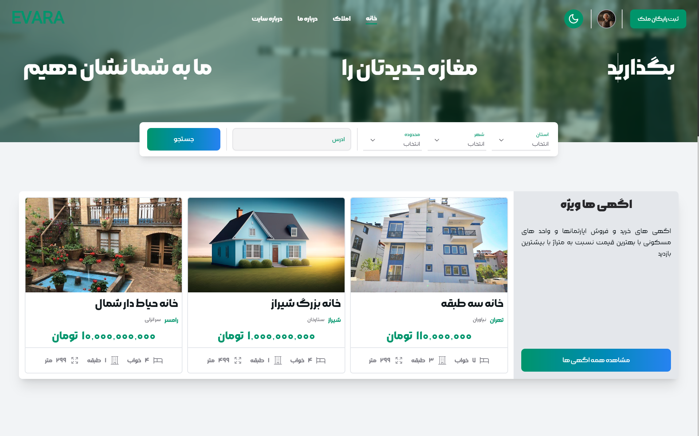
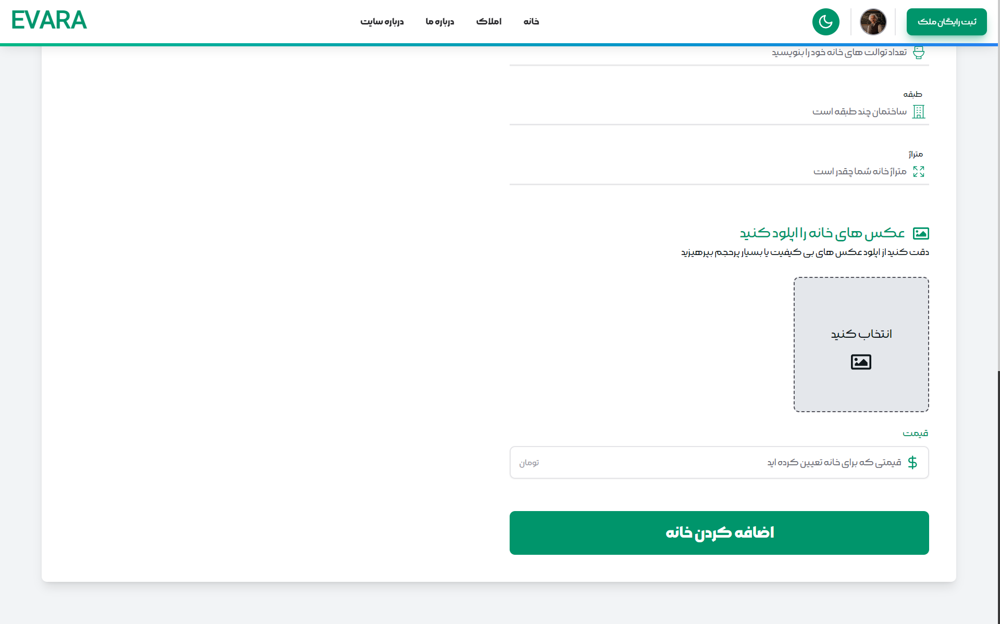

<h1 align="center">
  <br>
  <a href="https://github.com/Mohamadshiravi/evara.git"></a>
</h1>

<h4 align="center">A full-stack real estate website with Next UI</h4>

<p align="center">

  <a href="http://nextjs.org">
    
    
    
  </a>

</p>

<br/>

### Features:

- **user authentication with refresh Token(30s) without external pakage**
- **dark mode**
- **upload and change profile photo**
- **add house with any details and photo**
- **photos upload on ImageKit cloud storage**
- **advanced search**
- **save house**
- **special slider**

<h1 align="center">
  <a href="https://github.com/Mohamadshiravi/evara.git"></a>
</h1>

Live on [https://evara-six.vercel.app/](https://evara-six.vercel.app/)
<br />

## Run Project on local

**Note:**

> !!! You need MongoDB for Run Project
> !!! You need ImageKit account and storage for upload on cloud

add This environment variables to run project :

```bash
PRIVATE_KEY : randomString
MONGODB_URI : your mongodb connection string

NEXT_PUBLIC_PUBLIC_KEY= 'get it form Imagekit'
CLOUD_PRIVATE_KEY='get it form Imagekit'
NEXT_PUBLIC_URL_ENDPOINT='get it form Imagekit'
```

And, You Need build Project By :

```bash
npm run build
# or
yarn build
# or
pnpm build
```

Next Run with :

```bash
npm run start
# or
yarn start
# or
pnpm start
```

Open [http://localhost:3000](http://localhost:3000) with your browser to see the project
